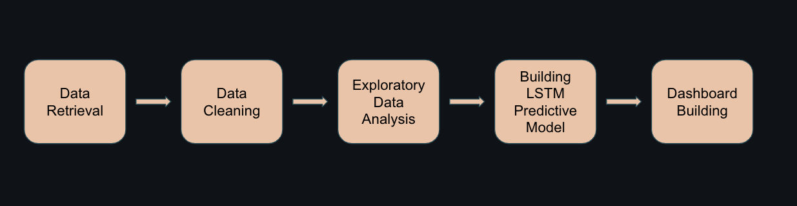
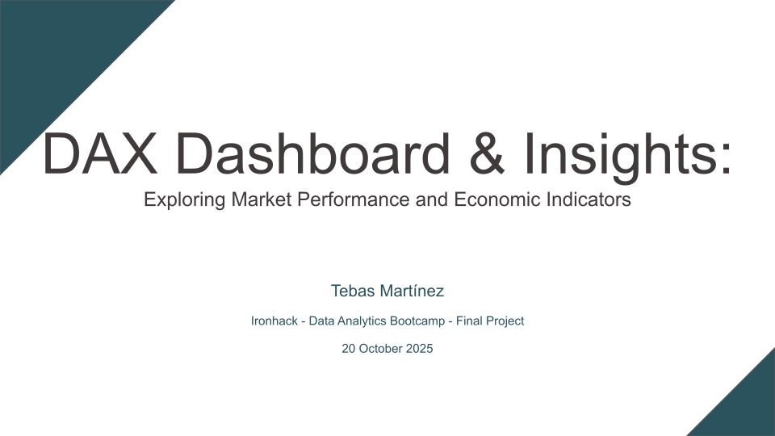

# DAX Dashboard & Insights: Exploring Market Performance and Economic Indicators

In this project I create a dashboard and explore company and industry stock market data (close prices, returns, volumes) for companies that are part of the DAX and their correlations with macroeconomic and social indicators such  as exchange rates (EUR to USD and EUR to GBP), ECB interest rates, and unemployment rates in Germany.

## Objectives
- Creating a dashboard that allows for data exploration.
- Exploring if/how ECB interest rates, exchange rates, and unemployment affect DAX performance, and understand if we can predict DAX performance based on these variables.

## Methodology


### Data Retrieval
- List of companies in the DAX as of 22 September 2025 web scraped from [Wikipedia](https://de.wikipedia.org/wiki/DAX).
- Prices retrieved from Yahoo! Finance's API using the [yfinance Python library](https://pypi.org/project/yfinance/).
- Macroeconomic indicators:
  - Exchange rates (EUR/USD and EUR/GBP) and ECB interest rates from [Deutsche Bundesbank](https://www.bundesbank.de/en/statistics/time-series-databases).
  - Unemployment rates from [Bundesagentur für Arbeit](https://statistik.arbeitsagentur.de/DE/Navigation/Statistiken/Interaktive-Statistiken/Zeitreihen/Lange-Zeitreihen-Nav.html?Fachstatistik%3Dalo%26DR_Gebietsstruktur%3Dd%26Gebiete_Region%3DDeutschland%26DR_Region%3Dd%26DR_Region_d%3Dd%26DR_RK%3Dinsg%26mapHadSelection%3Dfalse%26toggleswitch_saison%3D0).

#### Roadblocks
- Limits in free-tier plans of different news APIs ([NewsAPI](https://newsapi.org/), [mediastack](https://mediastack.com/), [FMP](https://site.financialmodelingprep.com/)), impeding the extraction of sentiment-related data, which had been initially planned as part of the project.

- Relevant files:
  - `00 Data Retrieval.ipynb`

### Exploratory Data Analysis
- Univariate EDA performed in a Jupyter Notebook.
- Bivariate EDA through exploration of the created dashboard and Jupyter Notebook.
- Relevant files:
  - `01 Univariate EDA.ipynb`
  - `02 Bivariate EDA.ipynb`

### LSTM Models
- Created a model per company in the DAX to predict future market performance.
- Relevant files:
  - `03 Predictive Model.ipynb`

### Dashboard creation
- Using the Streamlit library, I created a dashboard to allow for exploration of the data per company or industry, and their correlations with macroeconomic and social indicators, as well as use of thee predictive models.
- Relevant files:
  - `app.py`
  - `functions.py`

## Running the dashboard
The web app dashboard can be seen by running the following command from this repo:
````
streamlit run app.py
````

## Presentation
[](https://docs.google.com/presentation/d/1_wFnjfKWAGntQ8lYFWorvkFUkp4eBXYnENGLja44Ntg/edit?usp=sharing)